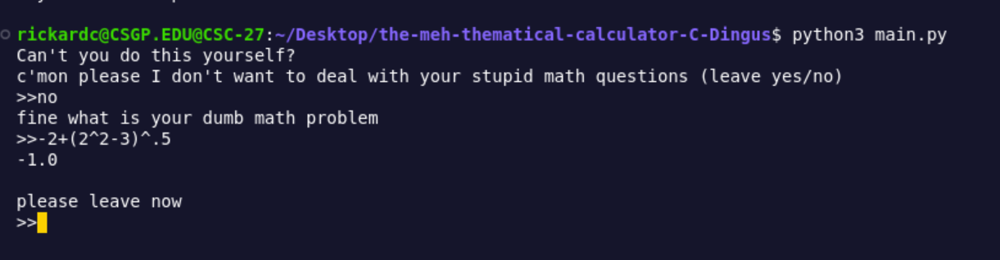

## Methematical Calculator

### requirements
python3

### Install
clone the git and run the main.py file

### Usage
Once you get to the input stage just input any thing with `( ) + - / * ^`

### Things to note
you can't multiply with parenthasis so yo need to use the multiplication operator * `(1+1)*2`

### Example

